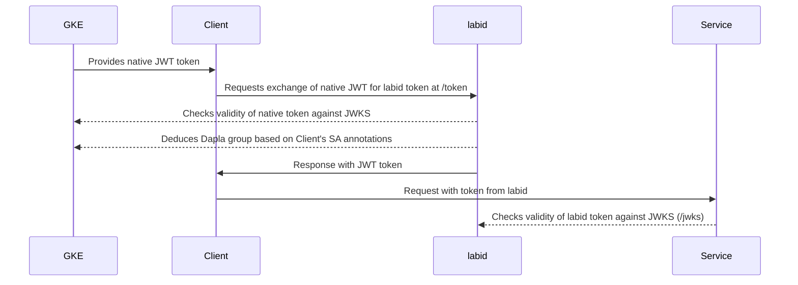

# LabID

Signed JWT token exchange service

## Usage

LabID is used from Dapla Lab for exchanging tokens, and from external services
to validate these tokens. Following is a short description of how to use LabID.

### Servers

LabID is available in all three Dapla Lab environments (dev, test, prod).
Internally it is always available at `http://labid.labid.svc.cluster.local`.
External endpoints are available at 

| Environment | URL |
| - | - |
| dev | https://labid.lab.dapla-dev-external.ssb.no |
| test | https://labid.lab.dapla-test-external.ssb.no |
| prod | https://labid.lab.dapla-external.ssb.no |

The external URLs are available from SSB IPs (VPN) and the corresponding Nais
clusters (nais-test for dev and test, nais-prod for prod).

### Endpoints
LabID exposes 3 endpoints: `/token`, `/jwks` and
`/.well-known/openid-configuration`. 

#### `/token` (cluster-internal only)
Lets you exchange a Kubernetes service account token for a LabID token.
It is only available internally from Dapla Lab services. Python users can use
[dapla-auth-client](https://github.com/statisticsnorway/dapla-auth-client) to
perform the exchange. The endpoint follows the 
[RFC8693](https://datatracker.ietf.org/doc/html/rfc8693) standard, but in a very
restricted way. An example request is as follows:

```sh
curl -vvv 'http://labid.labid.svc.cluster.local/token' \
--header 'Content-Type: application/x-www-form-urlencoded' \
--data-urlencode 'grant_type=urn:ietf:params:oauth:grant-type:token-exchange' \
--data-urlencode 'subject_token_type=urn:ietf:params:oauth:grant-type:id_token' \
--data-urlencode 'subject_token=<kubernetes-token>' \
--data-urlencode 'scope=current_group,all_groups' \
--data-urlencode 'audience=my-audience'
```

`Content-Type`, `grant_type` and `subject_token` must use the values above, no
other values are supported.

`scope` is an optional field and supports two values: 
1. `current_group` adds a `dapla.group` claim to the LabID token, whose value is
   the Dapla group the service is started as, e.g. `dapla-felles-developers`
2. `all_groups` adds a `dapla.groups` claim to the LabID token, which is a list
   of all the Dapla groups the user is a member of.

`audience` is an optional field and can be whatever you want.

`subject_token` must be the content of the file 
`/var/run/secrets/kubernetes.io/serviceaccount/token`, which is the service' SA
token.

#### `/jwks` (externally available)
Exposes the public part of LabID's signing keys, which can be used to validate 
the issued tokens. Usually this is handled automatically by auth libraries
through `/.well-known/openid-configuration`.

#### `/.well-known/openid-configuration` (externally available)
Exposes necessary information about LabID as an Authorization Server as
specified by [RFC8414](https://datatracker.ietf.org/doc/html/rfc8414). Usually
handled automatically by auth libraries.




# Contributing

Please follow these guidelines when contributing.

## Commit messages and merging PRs

Use squash merges, not merge commits.
This allows the release-please workflow to parse them and create a changelog.

This project follows [Conventional Commits](https://www.conventionalcommits.org/en/v1.0.0/) for its commit messages - **this also applies to squash merge messages**.
You can check out the following resources for more explanation/motivation:
[The power of conventional commits](https://julien.ponge.org/blog/the-power-of-conventional-commits/)
 and
[Conventional Commit Messages](https://gist.github.com/qoomon/5dfcdf8eec66a051ecd85625518cfd13).

When working on experimental branches you can use whatever commit messages you want, but you should either squash/amend your messages before merging your PR.
Using [Scratchpad branches](https://julien.ponge.org/blog/a-workflow-for-experiments-in-git-scratchpad-branches/) is probably the easiest approach.

Use the provided pre-commit hook to verify your commit messages:
```sh
pre-commit install --install-hooks
pre-commit install -t commit-msg
```

## Creating a release

Google's [release-please](https://github.com/googleapis/release-please) is used to create releases.
release-please maintains a release PR, which determines the next semver version based on whether there have been feature additions, breaking changes, etc.
To create a release, simply merge that PR, and it will create a GitHub release, tag and a Docker image will be built.

The suggested next version can be overriden by including `Release-As: x.x.x` in a commit message. For example:

```sh
git commit --allow-empty -m "chore: release 2.0.0" -m "Release-As: 2.0.0"
```

