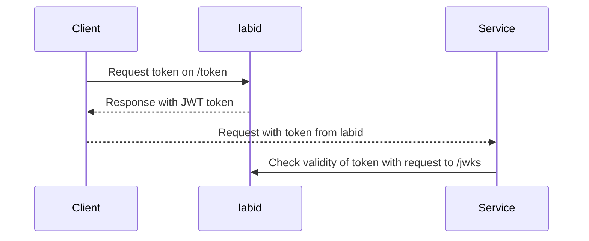

# labid (very WIP)

Signed JWT token exchange service

```mermaid
sequenceDiagram
    participant Client
    participant labid
    participant Service
    Client->>labid: Request token on /token
    labid-->>Client: Response with JWT token
    Client-->>Service: Request with token from labid
    Service->>labid: Check validity of token with request to /jwks
```
